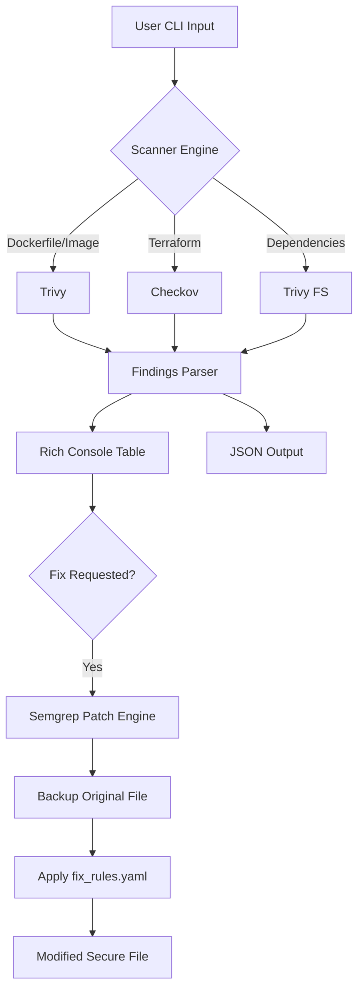

# Tessera ShieldPipe (Chang'e) Security CI 

## Introduction

ShieldPipe is a hybrid security automation orchestrator designed to scan and remediate security misconfigurations across Infrastructure as Code (IaC), Dockerfiles, and Python dependencies. 

It wraps industry-standard engines (**Trivy**, **Checkov**, and **Semgrep**) into a unified developer-friendly interface, providing automated "safe-patching" capabilities.

## Quick Start

### 1. Prerequisites
- **Python 3.10+**

  

- **Docker Desktop** (Must be running, as scanners run in isolated containers)

### 2. Installation

```bash
# Clone the repository
git clone git@github.com:mayerll/Tessera-ShieldPipe-Guard.git
cd Tessera-ShieldPipe-Guard

# Initialize environment
python3 -m venv venv
source venv/bin/activate

# Install dependencies
pip install -r requirements.txt
pip install --upgrade pip
```

Then your environment is now fully configured. Tessera ShieldPipe Guard is ready to use via the CLI.

## Usage Guide

### 1. Installation and Environment Setup

Run these commands to initialize your local development environment:

```bash
# Clone the repository
git clone git@github.com:mayerll/Tessera-ShieldPipe-Guard.git
cd Tessera-ShieldPipe-Guard

# Initialize virtual environment
python3 -m venv venv
source venv/bin/activate

# Install required dependencies
pip install -r requirements.txt
pip install --upgrade pip
```


## 2. Scanning Targets

Users can obtain real-time security scan results for various targets—including Dockerfiles, Terraform configurations, baked Docker images, and Python dependencies—directly via the CLI. 

ShieldPipe provides a human-readable table by default, but users can also request structured JSON output, which is ideal for integration into automated CI/CD pipelines or external security dashboards.

To showcase the capabilities of ShieldPipe, the tests/ directory contains a deliberate set of "insecure-by-design" artifacts. These samples demonstrate how the tool identifies and remediates real-world security risks across different layers of the stack.

### Insecure Test Artifacts Overview

#### 1. Dockerfile (Container Configuration)

Vulnerability: Uses the :latest tag, which is non-deterministic and makes audits difficult.
Risk: It runs as the root user, increasing the attack surface if the container is breached.
Misconfiguration: Lacks a HEALTHCHECK and uses apt-get without cleaning up the cache, leading to bloated and insecure images.

####  2. main.tf (Infrastructure as Code)

S3 Bucket: Configured with a public-read ACL, simulating a data leak scenario.
Security Group: Contains an ingress rule allowing SSH (Port 22) from 0.0.0.0/0, exposing the instance to global brute-force attacks.
EBS Volume: Set to encrypted = false, failing data-at-rest compliance standards.
Hardcoded Secrets: Contains a plaintext password within an aws_db_instance block.

####  3. requirements.txt (Python Dependencies)

Flask 0.12.1: A legacy version vulnerable to multiple Denial of Service (DoS) attacks and session cookie disclosure.
Requests 2.20.0: Vulnerable to CVE-2018-18074, which can lead to unintended credential leakage during cross-domain redirects.

####  4. python:3.9-slim (Baked Docker Image)

Vulnerability: This represents a pre-built image that may contain OS-level vulnerabilities (CVEs) in its system libraries (like openssl or libc).
Detection: ShieldPipe triggers an image scan to identify vulnerabilities that exist within the binary layers, even if the Dockerfile itself appears clean.

Note: Remediation features (--fix, --dry-run, and rollback) are available for source files only; pre-built Docker images are support scan-only.
Image no dryrun Why?
* Images are Read-Only: A container image is a compiled artifact. You cannot "patch" or "fix" the binary layers of an existing image directly.
* Remediation Target: Remediation (Auto-fix) only works on Source Files (like Dockerfile requirements.txt or main.tf) because those are text files your tool can rewrite.


### Standard Console Output
Run these commands to view a formatted summary of findings, including Rule IDs, Severity levels, and descriptive messages in your terminal.

```bash
# Scan a local Dockerfile for misconfigurations
python3 main.py scan ./tests/Dockerfile

# Scan Infrastructure as Code (Terraform) for security gaps
python3 main.py scan ./tests/main.tf

# Scan Python requirements for vulnerable dependencies (CVEs)
python3 main.py scan ./tests/requirements.txt

# Scan a pre-built (baked) Docker image for OS-level vulnerabilities
python3 main.py scan python:3.9-slim
```
Please refer to the logs listed below:

```bash
# Scan a local Dockerfile for misconfigurations
python3 main.py scan ./tests/Dockerfile
```


```bash
# Scan Infrastructure as Code (Terraform) for security gaps
python3 main.py scan ./tests/main.tf
```


```bash
# Scan Python requirements for vulnerable dependencies (CVEs)
python3 main.py scan ./tests/requirements.txt
```


```bash
# Scan a pre-built (baked) Docker image for OS-level vulnerabilities
python3 main.py scan python:3.9-slim
```


### Structured JSON Output

Use the --json flag to generate machine-readable data. This output includes a full list of findings and a severity summary, making it easy for scripts to parse and enforce security gates.

```bash
# Generate JSON report for Dockerfile
python3 main.py scan ./tests/Dockerfile --json
```


```bash
# Generate JSON report for Terraform
python3 main.py scan ./tests/main.tf --json
```


```bash
# Generate JSON report for Dependencies
python3 main.py scan ./tests/requirements.txt --json
```


```bash
# Generate JSON report for a Container Image
python3 main.py scan python:3.9-slim --json
```


## 3. Proposed Fixes (Dry-run)

Users can preview security patches before they are applied to the source code. By using the `--dry-run` flag, ShieldPipe simulates the remediation process and generates a unified diff in the terminal, showing exactly which lines will be modified, added, or removed. 

This allows developers to audit security changes for accuracy and compatibility before committing to a permanent fix.
Firstly, developers need to check the file fix_rules.yaml, please refer to the introduction listed below:

### Customizable Remediation Engine (fix_rules.yaml)

ShieldPipe's remediation logic is decoupled from the core scanning engine via `fix_rules.yaml`. This design acknowledges that security remediation is not "one size fits all" and allows organizations to tailor fixes to their specific internal security policies.

#### Key Benefits of Rule-Based Remediation

1. **Organizational Policy Alignment**: Different companies have different standards. While one organization may require Alpine-based images, another may mandate hardened RHEL-based images. ShieldPipe allows SecOps teams to define exactly how a vulnerability should be patched to meet their unique compliance requirements.

2. **Compliance as Code**: By storing remediation logic in a version-controlled YAML file, the "Rules of Engagement" for security fixes become transparent, auditable, and easy to update across the entire engineering organization.

3. **Decoupled Logic**: Separating "Detection" from "Remediation" means you can update your patching strategy (e.g., upgrading a global dependency version) without needing to modify the underlying Python source code or redeploy the tool.

4. **Risk Mitigation**: This architecture ensures that ShieldPipe is not a "black box." Security teams have full control over the automated modifications made to the codebase, preventing automated patches from breaking proprietary internal configurations.

---

#### Example: Tailoring a Rule
If your company requires a specific internal mirror for apt-get, you simply update the `fix` pattern in `fix_rules.yaml`:

```yaml
  - id: DS-0029-internal-mirror
    languages: [dockerfile]
    pattern: "RUN apt-get update"
    fix: "RUN sed -i 's/deb.debian.org/://internal-mirror.company.com' /etc/apt/sources.list && apt-get update"
```

Then we can start the remediation.

### Preview Remediation
Run these commands to view the proposed security improvements for each target type:

```bash
# Preview fixes for Dockerfile misconfigurations
python3 main.py scan ./tests/Dockerfile --dry-run 

# Preview security hardening for Terraform files
python3 main.py scan ./tests/main.tf --dry-run 

# Preview version upgrades for Python dependencies
python3 main.py scan ./tests/requirements.txt --dry-run 
```

Logs:

```bash
# Preview fixes for Dockerfile misconfigurations
python3 main.py scan ./tests/Dockerfile --dry-run 
```


```bash
# Preview security hardening for Terraform files
python3 main.py scan ./tests/main.tf --dry-run 
```


```bash
# Preview version upgrades for Python dependencies
python3 main.py scan ./tests/requirements.txt --dry-run 
```


## 4. Automatic Remediation (Fix)

ShieldPipe can automatically apply security patches and hardening configurations directly to your source files. When the `--fix` flag is used, the tool executes a "Safe-Patching" workflow: it first creates an atomic backup of the target file in the `.shieldpipe_backups` directory and then applies the remediation logic defined in `fix_rules.yaml`.

This feature allows developers to instantly move from vulnerability detection to remediation with a single command.

### Apply Security Patches
Run these commands to automatically harden your infrastructure and dependencies:

```bash
# Automatically fix Dockerfile misconfigurations (e.g., pinning versions, adding non-root users)
python3 main.py scan ./tests/Dockerfile --fix  

# Automatically fix Terraform security gaps (e.g., S3 ACLs, Security Group CIDRs)
python3 main.py scan ./tests/main.tf --fix 

# Automatically upgrade vulnerable Python dependencies in requirements.txt
python3 main.py scan ./tests/requirements.txt --fix 
```

Logs:

```bash
# Automatically fix Dockerfile misconfigurations (e.g., pinning versions, adding non-root users)
# The patched file overwrites ./tests/Dockerfile, and the original is archived in .shieldpipe_backups/Dockerfile
python3 main.py scan ./tests/Dockerfile --fix
```


```bash
# Automatically remediate Terraform security gaps (e.g., S3 ACLs, Security Group CIDRs).
# The patched file overwrites ./tests/main.tf, and the original is archived in .shieldpipe_backups/main.tf
python3 main.py scan ./tests/main.tf --fix
```


```bash
# Automatically upgrade vulnerable Python dependencies in requirements.txt
# The patched file overwrites ./tests/requirements.txt, and the original is archived in .shieldpipe_backups/requirements.txt
python3 main.py scan ./tests/requirements.txt --fix 
```


## 5. Rollback

ShieldPipe prioritizes system stability by providing a built-in recovery mechanism. Every time the `--fix` command is executed, an atomic backup is automatically generated and stored in the `.shieldpipe_backups` directory. 

If an applied patch causes a configuration error or a build regression, users can instantly restore the file to its previous state using the `rollback` command.

### Restore Files
Run these commands to revert security changes for specific targets:

```bash
# Revert security changes to the original Dockerfile
# The original Dockerfile has been copied to ./tests/Dockerfile from .shieldpipe_backups/Dockerfile
python3 main.py rollback ./tests/Dockerfile

# Revert security changes to the Terraform configuration
# The original Dockerfile has been copied to ./tests/main.tf  from .shieldpipe_backups/main.tf 
python3 main.py rollback ./tests/main.tf 

# Revert version upgrades to requirements.txt
# The original Dockerfile has been copied to ./tests/requirements.txt  from .shieldpipe_backups/requirements.txt
python3 main.py rollback ./tests/requirements.txt
```

Logs:


### Rollback Confirmation

When a rollback is successful, the CLI provides immediate confirmation:

```text
Rollback successful: ./tests/Dockerfile restored.
```

## 6. GitHub Actions CI/CD Integration

ShieldPipe is designed to be "CI-First." The included GitHub Actions workflow provides a multi-stage security pipeline that automatically validates, scans, and enforces security policies on every push or pull request.

### Pipeline Architecture
The workflow is divided into three isolated jobs to ensure modularity and performance:

1.  **Validate**: Runs the Pytest suite to ensure the ShieldPipe engine, Docker mounts, and Semgrep rules are functioning correctly before initiating scans.
2.  **Scanning**: Executes parallel scans across all targets (Dockerfiles, Terraform, and Dependencies). It captures both Standard Output and Errors into structured JSON reports.
3.  **Enforcement**: Acts as the "Security Gate." It downloads the consolidated reports and checks for any CRITICAL or HIGH severity findings.

### Example Configuration
To use this in your repository, create a file at `.github/workflows/security-scan.yml`:

```yaml
name: ShieldPipe Security CI

on:
  push:
    # Trigger on every push to the current branch
    branches: [ '**' ]
  pull_request:
    # Trigger on pull requests to any branch to catch issues before merge
    branches: [ '**' ]

jobs:
  # Job 1: Unit Testing
  Validate:
    runs-on: ubuntu-latest
    steps:
      - name: Checkout Code
        uses: actions/checkout@v4
      - name: Setup Python
        uses: actions/setup-python@v5
        with:
          python-version: '3.11'
          cache: 'pip'
      - name: Install Dependencies
        run: |
          pip install pytest typer rich checkov semgrep
          if [ -f requirements.txt ]; then pip install -r requirements.txt; fi
      - name: Run Unit Tests
        run: python3 -m pytest tests/test_shieldpipe.py

  # Job 2: Security Scanning
  Scanning:
    needs: Validate
    runs-on: ubuntu-latest
    steps:
      - name: Checkout Code
        uses: actions/checkout@v4
      - name: Setup Python
        uses: actions/setup-python@v5
        with:
          python-version: '3.11'
          cache: 'pip'
      - name: Install Dependencies
        run: pip install typer rich checkov semgrep
      - name: Create Reports Directory
        run: mkdir -p reports && chmod 777 reports
      - name: Run Multi-Target Scans
        run: |
          python3 main.py scan ./tests/Dockerfile --json 2>&1 | tee reports/dockerfile.json
          python3 main.py scan ./tests/main.tf --json 2>&1 | tee reports/terraform.json
          python3 main.py scan ./tests/requirements.txt --json 2>&1 | tee reports/deps.json
        continue-on-error: true
      - name: Upload Raw Results
        uses: actions/upload-artifact@v4
        with:
          name: raw-reports
          path: reports/*.json

  # Job 3: Final Security Gate
  Enforcement:
    needs: Scanning
    runs-on: ubuntu-latest
    steps:
      - name: Download Reports
        uses: actions/download-artifact@v4
        with:
          name: raw-reports
          path: reports
          merge-multiple: true
      - name: Security Gate Check
        run: |
          # Fails the build if any report contains HIGH or CRITICAL findings
          if grep -rqE "CRITICAL|HIGH" reports/; then
            echo "Security Gate Failed: High-risk vulnerabilities detected"
            exit 1
          else
            echo "Security Gate Passed: No high-risk issues found"
          fi
```

### Artifact Retention and Downloads

Every successful or failed run of the **ShieldPipe Security CI** pipeline generates downloadable security reports. This allows security teams and developers to perform offline audits or keep a historical record of vulnerabilities.

#### How to Download Reports:
1. Navigate to the **Actions** tab in your GitHub repository.
2. Select the specific workflow run you wish to inspect.
3. Scroll down to the **Artifacts** section at the bottom of the summary page.
4. Click on workflows in ActionCI to download a ZIP archive containing all JSON scan results (e.g., `dockerfile-scan.json`, `terraform-scan.json`).

#### Artifact Specification:
- **Format**: Structured JSON.
- **Retention**: Reports are stored for 90 days by default (compliant with standard audit cycles).
- **Accessibility**: Available even if the **Security Gate** fails, ensuring you have the data needed to fix the reported issues.

Click the Download button within the red-highlighted area to get the security scan reports.


Security Scan Report:


## Architecture Design and Workflow

ShieldPipe follows a "Detect -> Report -> Remediate" cycle.



### Process Flow

The ShieldPipe execution pipeline consists of five distinct stages designed to ensure accuracy and safety:

1.  **Target Identification**: The orchestrator automatically determines the target type (Infrastructure as Code, Container, or Dependency) based on the file extension, filename, or image string.
2.  **Containerized Scanning**: Triggers a Dockerized instance of Trivy or Checkov. This ensures the scanning environment is isolated, reproducible, and always utilizes the most current vulnerability databases.
3.  **Structured Reporting**: Aggregates raw outputs from multiple engines into a unified internal data model. This data is then rendered into human-readable Rich tables or machine-readable JSON.
4.  **Semantic Patching**: If remediation is requested, the tool executes Semgrep rules. Unlike traditional regex, this process understands code syntax, allowing for precise modifications (e.g., adding a non-root user specifically after the `FROM` instruction).
5.  **State Management**: Before any write operation, ShieldPipe creates an atomic backup in the `.shieldpipe_backups` directory, enabling the built-in rollback mechanism.

## Implementation Strategy

The implementation of ShieldPipe is based on three core technical pillars designed to meet the requirements of modern DevSecOps environments:

1.  **Hybrid Orchestration**: By leveraging **Trivy** and **Checkov** via Docker containers, ShieldPipe ensures that its scanning engines are always up-to-date with the latest CVE databases and security policies without requiring manual maintenance of the local host environment.
2.  **Semantic Remediation**: ShieldPipe utilizes **Semgrep** for code patching. Unlike traditional regex-based replacement, Semgrep is syntax-aware and understands code structure. This allows the tool to make precise modifications—such as inserting a non-root user specifically after the `FROM` instruction—while maintaining valid file syntax.
3.  **Safety and Atomicity**: Security automation must be safe. ShieldPipe implements mandatory atomic backups before any write operation. The dry-run mode provides a unified diff preview, enabling developers to audit proposed security improvements before they are committed to disk.
4.  **Platform Agnostic Design**: The tool is built with **Python 3.10+** and **Typer**, ensuring it can run across different operating systems. By containerizing the heavy-lifting scan engines, it minimizes the "it works on my machine" problem in CI/CD runners.


## Roadmap and Bug List (Future Improvements)

1. **System Help and Input Validation**: 
   - Enhance the built-in help system with detailed subcommand documentation.
   - Implement strict input sanitization to prevent Directory Traversal attacks and handle malformed container image names. 
   - Add pre-execution checks to verify local file existence before initiating resource-heavy Docker processes.

2. **REST API and Multi-Interface Support**: 
   - Currently, remediation features (fix, rollback, dry-run) are CLI-only. 
   - Future versions will decouple the core orchestration logic and wrap it in a **FastAPI** layer. This will support remote Webhook triggers, centralized security monitoring, and integration with external dashboards.

3. **Structured Remediation Reporting**: 
   - Transition from human-readable terminal diffs to structured JSON reporting for the --fix and --dry-run flags. This is essential for automated security auditing and multi-tool interoperability.

4. **Post-Fix Automated Validation**: 
   - Integrate automated syntax verification (e.g., `terraform validate` or `docker build --dry-run`) immediately after a patch is applied. This ensures the codebase remains functional and prevents syntax regressions.

5. **Enhanced Rollback History**: 
   - Expand the current "single-version" backup system into a multi-version history tracking system. 
   - Use a local metadata store (e.g., SQLite or structured JSON) to allow users to revert to any previous historical state based on timestamps and unique IDs.

6. **Command Logic and Conflict Resolution**: 
   - Implement a command validator to prevent conflicting flag execution. For example, ensuring --fix and --json do not run simultaneously without a specifically defined remediation schema, ensuring predictable behavior in CI/CD pipelines.

